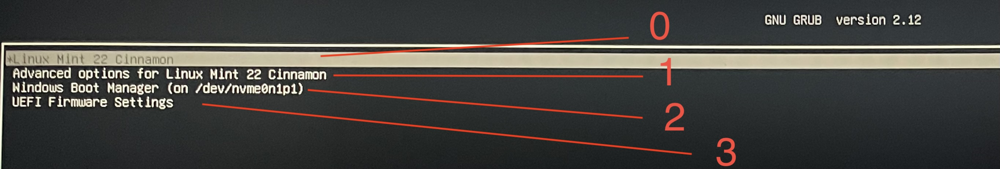

# 🔁 Reboot from Linux into any other OS (Dual Boot) via SSH

This guide shows how to **remotely reboot into Any Grub Boot Menu option while remoting into linux** on a dual-boot system.

> ✅ For example: when you're SSH'd into a Linux system (e.g., Linux Mint) and want the **next boot to go to Windows** without physically interacting with the machine.

---

## 📋 Prerequisites

- Dual boot setup with Linux (e.g., Mint) and another OS
- GRUB bootloader and boot menu
- SSH access to the Linux system

---
For full details, Check [Grub's Official Documentation](https://www.gnu.org/software/grub/grub-documentation.html)

## 🧾 Step-by-Step
For this example, I assume you want to boot into your windows for simplicity

### 1. 🔍 Find the Windows GRUB entry

What we're doing is basically filtering through `/boot/grub/grub.cfg` to get the lines we want, there're many ways to do so but the simplest is just to run this command:

```bash
awk -F\' '/menuentry / {print i++ ": " $2}' /boot/grub/grub.cfg
```
The output will look something like this: 
```
0: Linux Mint 22 Cinnamon
1: Linux Mint 22 Cinnamon, with Linux 6.8.0-40-generic
2: Linux Mint 22 Cinnamon, with Linux 6.8.0-40-generic (recovery mode)
3: Linux Mint 22 Cinnamon, with Linux 6.8.0-39-generic
4: Linux Mint 22 Cinnamon, with Linux 6.8.0-39-generic (recovery mode)
5: Linux Mint 22 Cinnamon, with Linux 6.8.0-38-generic
6: Linux Mint 22 Cinnamon, with Linux 6.8.0-38-generic (recovery mode)
7: Windows Boot Manager (on /dev/nvme0n1p1)
8: UEFI Firmware Settings
```
Copy the name **exactly**, without the index:
```Windows Boot Manager (on /dev/nvme0n1p1)```

Or, if for any reason you didn't find the Windows entry, run this command:

```bash
sudo grep -i menuentry /boot/grub/grub.cfg
```

And look for:

```
menuentry 'Windows Boot Manager (on /dev/nvme0n1p1)' --class windows --class os ...
```

The name is in quotes.

---

### 2. 🚀 Reboot into Windows (once)

Now that you have your menu entry, just use `grub-reboot` with it:

```bash
sudo grub-reboot "Windows Boot Manager (on /dev/nvme0n1p1)"
sudo reboot
```

The name in `""` should be **exact**.

For this example, the system will reboot **into Windows one time**, then revert to the default OS (Linux for me).

---

### 3. (Optional) 🔁 Make Windows the default

To boot into Windows **every time by default**:

```bash
sudo grub-set-default "Windows Boot Manager (on /dev/nvme0n1p1)"
sudo update-grub
```

You can undo this later with:

```bash
sudo grub-set-default 0  # Assuming Linux is first entry, index works as the image shows
sudo update-grub
```



---

### 4. Extra:
You'd use the index instead of the name to reboot into the OS once:

```bash
sudo grub-reboot 2
sudo reboot
```

---

## 🧠 Notes

- This uses GRUB’s **temporary boot override** via `grub-reboot`
- You need `sudo` privileges to run it

---

## 🧵 Related GRUB Commands

- `grub-reboot` – Set next boot only
- `grub-set-default` – Change default permanently
- `update-grub` – Regenerates GRUB menu

---

## Future:
- Make it a simple script so you'd remotely run to avoid the manual process

---

## 🖤 Credits

Written by [Abdullah Alafari](https://github.com/AlafariAbdullah), tested on Linux Mint 22 Cinnamon with GRUB2.

Connect with me on [Linkedin](www.linkedin.com/in/alafari-abdullah)

