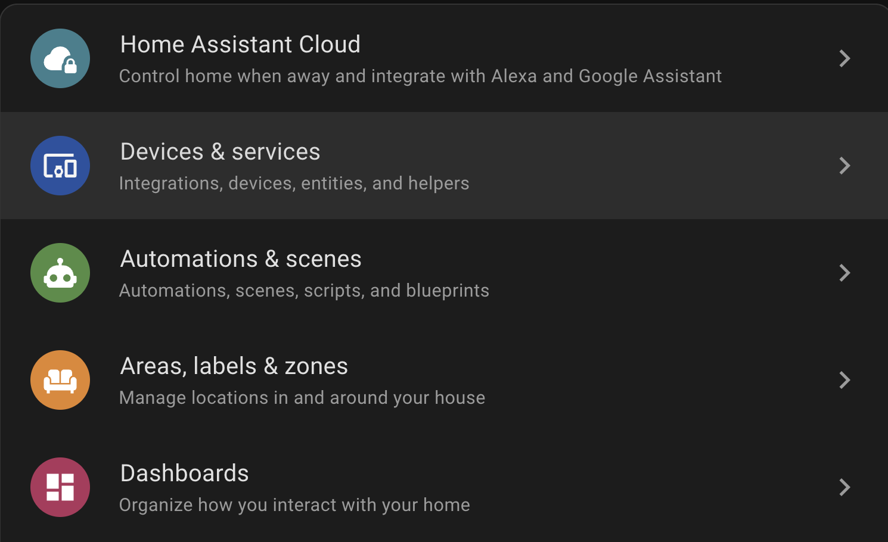
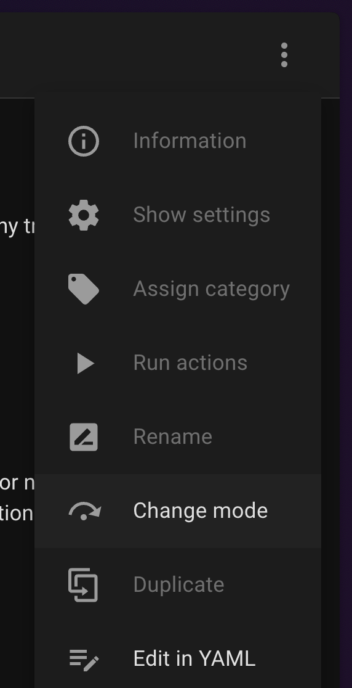

## How to set up a time based simple automation trigger/condition
(Time Passes Since X)

## Introduction
This tutorial will guide you through creating a time-based automation using Home Assistant’s built-in “Helpers.” In this tutorial, you’ll learn how to:
	- Create a Helper to store the date and time.
	- Use Jinja2 and simple YAML to create automation triggers.
	- Apply this automation to various use cases, such as:
	    - Sending a notification to your phone after a certain number of days, like when you haven’t done the laundry.
	    - Triggering a charger on your Plugged-in HA Dashboard every set number of hours.
You’ll modify the Jinja2 script to suit your own setup, and the “Helpers” will allow you to easily store and update the base time for automation triggers/condition.

## Table of Contents
- [Prerequisites](#prerequisites)
- [Step 1 : Making a Helper](#step-1--making-a-helper)
- [Step 2 : Making the Automation trigger/condition](#step-2--making-the-automation-triggercondition)
- [Updating the Helper](#updating-the-helper)
- [Example Use](#example-use-)


## Prerequisites
- A working Home Assistant installation (any of the following setups will work: HA OS, Docker, Supervised, or HA Core).


## Step 1 : Making a Helper
Creating a Helper to store the time you want to start counting from is the simplest way to easily update it (if needed) via a button or another method.
- Go to **Settings** at the bottom left > **Devices and Services** > **Helpers**


- Create a **New Helper**
- **Data and/or Time**

- Give your new Helper a name and choose "Date and Time"
- Click **Create** to create the new helper

- Note : To get the entity ID of your new Helper, click on the three dots at the right and then **Show Settings** Entity ID will be as follows (input_datetime.{HELPERNAME})


## Step 2 : Making the Automation trigger/condition
We will use the Helper as a baseline to calculate the time that has passed after the {Helper}.
The basic code you’ll need to insert is :
- Use one of these, depending on whether you’re using it as the main trigger (e.g., “When X time passes, do Y”) or as a condition (e.g., “If I press a button, check if Y time has passed”).

```YAML
- condition: template
    value_template: >-
      {{ (now().timestamp() -
      (state_attr('{The Entity ID of your helper}', 'timestamp')
      or 0)) > {Time in seconds} }}
```
```YAML
- trigger: template
    value_template: >-
      {{ (now().timestamp() -
      (state_attr('{The Entity ID of your helper}', 'timestamp')
      or 0)) > {Time in seconds} }}
```

- **{The Entity ID of your Helper}** : Find this in [Step 1 - Note ](#step-1--making-a-helper)
- **{Time in seconds}**: 
    - 1 hour = 3600
    - 3 days = 259200
    - 1 week = 604800
    - 1 year = 31,536,000


- Next, go to **Settings** > **Automations & Scenes** > **Automation** 

- Create a new automation and click the three dots at the top, then choose **Edit in YAML**

- You should see something similar to this
```yaml
alias: {Your Title}
description: "{}"
triggers:
conditions:
actions:
```
- Copy either the trigger or the condition (from earlier) and paste it into the appropriate block. It should look like this, depending on whether you choose Triggers or Conditions: :

```yaml
alias: {Your Title}
description: "{}"
triggers:
- trigger: template
    value_template: >-
      {{ (now().timestamp() -
      (state_attr('{The Entity ID of your helper}', 'timestamp')
      or 0)) > {Time in seconds} }}
conditions:
actions:
```


## Updating the Helper
Updating the Helper is simple. You can do this by sending the following action through a script, button, or any other method :
```YAML
  - action: input_datetime.set_datetime
    metadata: {}
    data:
      datetime: "{{ now().strftime('%Y-%m-%d %H:%M:%S') }}"
    target:
      entity_id: input_datetime.colored_last_laundry_day
```

## Example Use :
I use this condition to receive a notification when 3 days have passed since the last time I did the laundry. The notification updates depending on how many days have passed (for example, if it’s 5 years later, the notification will reflect that).
The automation consists of :
- A **Date and Time Helper**
-** A Script** to update the Date and Time Helper
- An **Automation**

Helper : Date and time
Script : 
```YAML
sequence:
  - action: input_datetime.set_datetime
    metadata: {}
    data:
      datetime: "{{ now().strftime('%Y-%m-%d %H:%M:%S') }}"
    target:
      entity_id: input_datetime.inbetween_last_laundry_day
alias: update_inbetween_last_laundry_day
description: ""
```
Automation : 
```YAML
alias: Laundry Reminder After 3 Days or more
description: ""
triggers:
  - trigger: template
    value_template: >-
      {{ (now().timestamp() -
      (state_attr('input_datetime.input_datetime_last_laundry_day', 'timestamp')
      or 0)) > 259200 }}
conditions:
  - condition: template
    value_template: >-
      {{ (now().timestamp() -
      (state_attr('input_datetime.input_datetime_last_laundry_day', 'timestamp')
      or 0)) > 259200 }}
actions:
  - action: notify.mobile_app_abdullahs_iphone
    data:
      message: >-
        It's been {{ ((now().timestamp() - 
        (state_attr('input_datetime.input_datetime_last_laundry_day',
        'timestamp')  or 0)) // 86400) | int }} days since your last laundry.
      title: Do the Laundry!
```


## ---
This tutorial was created in my free time as a fun project. I am a Computer Science freshman at Prince Sultan University (PSU). If you’re interested, feel free to connect with me on [Linkedin](www.linkedin.com/in/alafari-abdullah)
